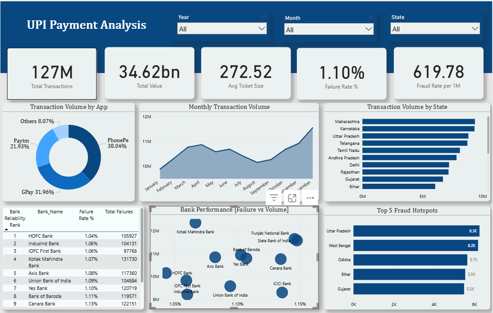

# 📊 UPI Payment Analysis Dashboard (Power BI)

## 📌 Project Overview
India’s **Unified Payments Interface (UPI)** has revolutionized digital payments, recording massive growth across states, banks, and payment apps. However, this rapid adoption has also introduced challenges such as **transaction failures, infrastructure stress, fraud risks, and regional performance gaps**.

This project delivers an **interactive Power BI dashboard** that provides a **single unified view** of UPI transaction performance, bank reliability, app market dominance, and fraud hotspots—enabling stakeholders to take **data-driven and proactive decisions**.

---

## 🎯 Business Problem
UPI data is fragmented across multiple reports and systems, making it difficult for stakeholders to:
- Identify where transaction failures are increasing
- Detect fraud-prone regions early
- Compare app performance and market dominance
- Understand bank-level reliability under heavy load

As a result, issues are often addressed **after service disruptions**, leading to customer dissatisfaction and higher operational costs.

---

## ✅ Objective
- Centralize UPI transaction and fraud data into one analytics layer  
- Track key KPIs like volume, value, failure rate, and fraud rate  
- Identify high-risk banks, states, and apps  
- Support better decision-making for banks, fintechs, and regulators  

---

## 🗂️ Data Model
The dashboard follows a **Star Schema architecture** for efficient analysis.

### Fact Tables
- **Transactions**: transaction volume, value, failures  
- **Fraud Details**: fraud count and fraud rate  

### Dimension Tables
- App  
- Bank  
- Calendar  
- Region  

📌 Two independent star schemas share common dimensions (Calendar and Region), allowing transaction and fraud analysis independently while maintaining shared context.

---

## 📈 Key KPIs
- **Total Transactions** – overall UPI adoption  
- **Total Transaction Value** – economic activity  
- **Average Ticket Size (ATS)** – user spending behavior  
- **Failure Rate (%)** – system reliability  
- **Fraud Rate** – security and risk exposure  

---

## 📊 Key Insights

### 🔹 App Market Dominance
- PhonePe, GPay, and Paytm together control **90%+** of UPI transactions  
- High concentration increases systemic risk during app downtime  

### 🔹 Transaction Growth Trend
- Steady growth from January to December  
- Year-over-year growth of **21.37%**  
- Seasonal dip during mid-year and surge during festive months  

### 🔹 State-wise Adoption
- Maharashtra leads in both transaction volume and value  
- Smaller states show lower adoption, indicating infrastructure and awareness gaps  

### 🔹 Bank Reliability
- HDFC Bank shows the lowest failure rate despite high volume  
- SBI and other large banks show higher failure rates under heavy load  
- Scatter analysis highlights scalability challenges  

### 🔹 Fraud Hotspots
- Uttar Pradesh, West Bengal, and Odisha record high fraud rates  
- Fraud does not directly correlate with transaction volume  
- Indicates need for targeted awareness and monitoring  

---

## 🛠️ Tools & Technologies
- **Power BI**
- **DAX**
- **Data Modeling (Star Schema)**
- **Data Visualization & KPI Design**

---

## 🚀 Business Impact
- Enables proactive monitoring of UPI performance  
- Helps banks optimize backend infrastructure  
- Assists regulators in identifying fraud-prone regions  
- Improves system reliability and customer trust  

---

## 📌 Conclusion
The UPI ecosystem has entered an **optimization and governance phase**.  
This dashboard demonstrates how analytics can support **scalability, reliability, and security** while sustaining India’s digital payment growth.

---

## 📂 Files in Repository
- `UPI project.pbix` – Interactive Power BI dashboard  
- `UPI power bi.pptx` – Business presentation  

---

## 🖼️ Dashboard Image Overview

> *(Add screenshots from Power BI using GitHub image upload)*

### Overall UPI Performance Dashboard

